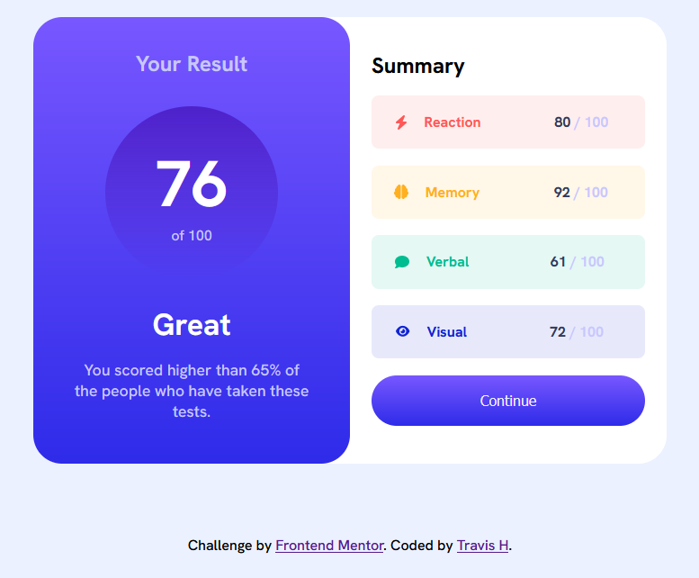
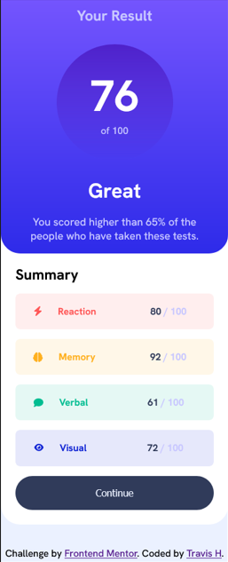

# Frontend Mentor - Results summary component solution

This is a solution to the [Results summary component challenge on Frontend Mentor](https://www.frontendmentor.io/challenges/results-summary-component-CE_K6s0maV).

## Table of contents

- [Frontend Mentor - Results summary component solution](#frontend-mentor---results-summary-component-solution)
  - [Table of contents](#table-of-contents)
  - [Overview](#overview)
    - [The challenge](#the-challenge)
    - [Screenshot](#screenshot)
    - [Links](#links)
  - [My process](#my-process)
    - [Built with](#built-with)
  - [Author](#author)

## Overview

### The challenge

Users should be able to:

- View the optimal layout for the interface depending on their device's screen size
- See hover and focus states for all interactive elements on the page

### Screenshot

Desktop View

Mobile View

### Links

- Solution URL: [Solution URL](https://github.com/TravisH-bot/results-summary-component-main)
- Live Site URL: [Live site URL](https://travish-bot.github.io/results-summary-component-main/)

## My process

### Built with

- Semantic HTML5 markup
- CSS custom properties
- Flexbox
- Media Queries

## Author

- Website - [Travis Hackbarth](https://travish-bot.github.io/My-Portfolio/)
- Frontend Mentor - [@TravisH-bot](https://www.frontendmentor.io/profile/TravisH-bot)

